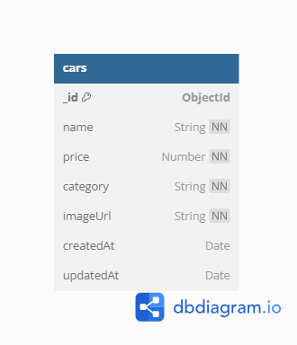

# Challenge 4 - Car Management

Pada Challenge kali ini membuat CRUD menggunakan sebuah database

## Duplikat porjek dan jalankan

1. Clone Repositori github

```bash
https://github.com/ancr18/FSW2-CH4-CG1.git
```

2. Install package

```bash
npm install
```

3. Membuat file .env berdasarkan .env.example

```bash
PORT= 3000
DATABASE_URI= your_uri_mongodb
IMAGEKIT_PUBLIC_KEY= your_public_key_imagekit
IMAGEKIT_PRIVATE_KEY= your_private_key_imagekit
IMAGEKIT_URL_ENDPOINT= your_url_endpoint_imagekit
```

4. Menjalankan projek

```bash
npm run dev
```

5. Buka browser, lalu akses http://localhost:3000

```bash
http://localhost:3000
```

## Routs

- [GET] Page List Cars => /dashboard

```bash
http://localhost:3000/dashboard
```

- [GET] Page Edit Car => /dashboard/edit/:id

```bash
http://localhost:3000/dashboard/edit/:id
```

- [GET] Page Create Car /dashboard/create

```bash
http://localhost:3000/dashboard/create
```

- [POST] Action Update Car => /cars/update/:id

```bash
http://localhost:3000/cars/update/:id
```

- [POST] Action Create Car => /cars/add

```bash
http://localhost:3000/cars/add
```

- [GET] Action Delete Car => /cars/delete:id

```bash
http://localhost:3000/cars/delete:id
```

## Database Diagram

Database menggunakan MongoDB

